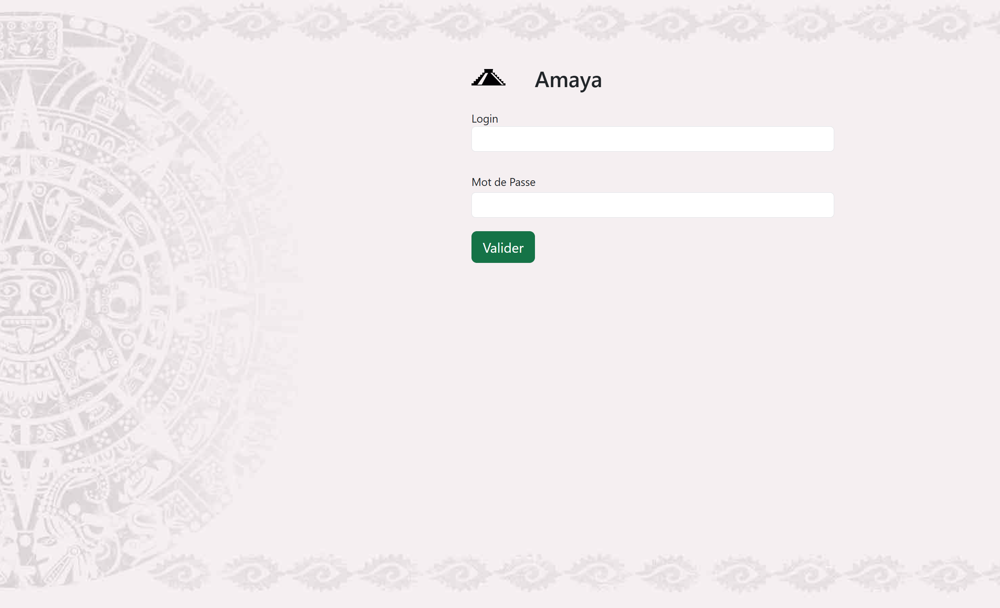
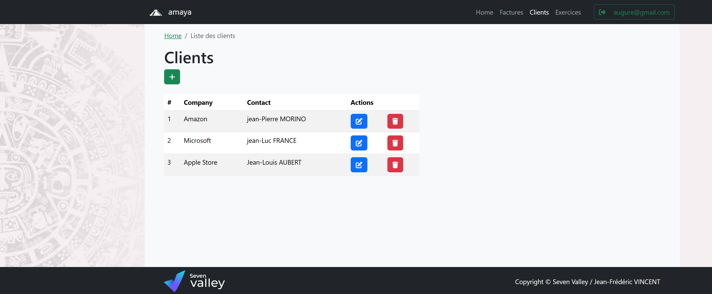
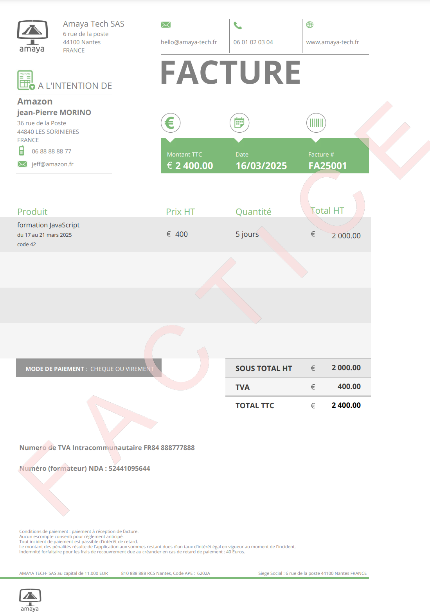

# Présentation de Amaya Facture
   
 
 

Amaya Facture vous permet de :
:one: Créer des factures  
:two: Créer des clients (pour les associer aux factures)  
:three: Créer exercice comptable (l'année en cours de facturation)    
_la liste des factures s'affiche en fonction de l'excercice comptable(année par année)_  

# Cahier des charges
## Qu'est ce qui est déjà fait ?

:one::white_check_mark: Création et modification d'un excercice comptable  
:two::white_check_mark: Création et modification d'un client  
:three::white_check_mark: Création et modification d'une facture  
:four::white_check_mark: Génération d'une facture en PDF avec <a href="https://artskydj.github.io/jsPDF/docs/jsPDF.html">JsPdf</a>  

## Qu'est ce qu'il reste à faire ?

### Comment sécuriser le logiciel ?
En effet lorsque une facture est validée, Il ne doit pas être possible de la modifier.  
Si la facture contient une erreur, Nous devons faire **une facture d'avoir**.  
Afin d'annuler cette facture. 
   
Nous devons mettre en place une vérification dans le cas ou l'utilisateur arriverait malgrés tout à modifier le total de la facture.
Il serait opportaint de verifier facture par facture le total de chaque facture.
Il serait aussi opportaint de verifier le total de toute les facture pour vérifier

-------------------
:one: Valider et "bloquer" une facture pour afficher le PDF  
  
:two: Sécuriser la modification de facture
_Empécher de modifier une facture déjà validé_*

:three: Sécuriser la suppression d'une facture
_Empécher de supprimer une facture validé_
_Vérifier la cohérence de toutes les factures_

-------------------
